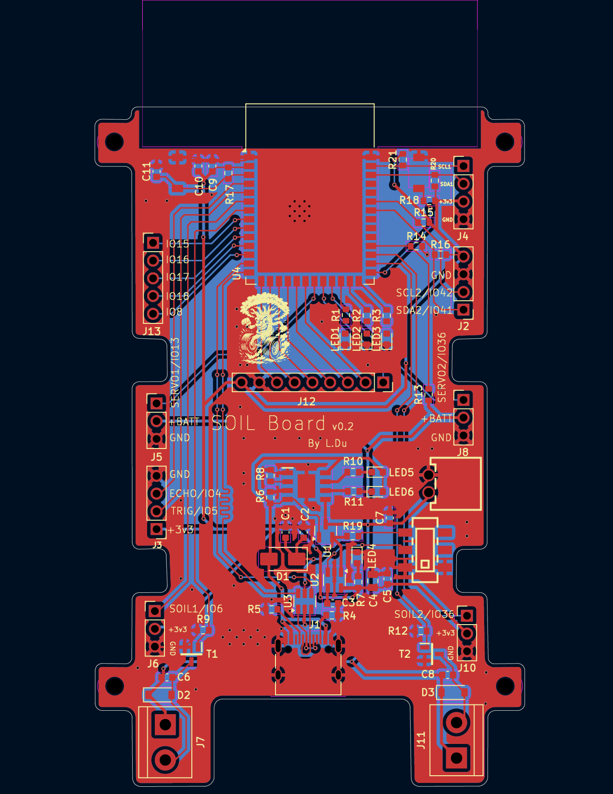
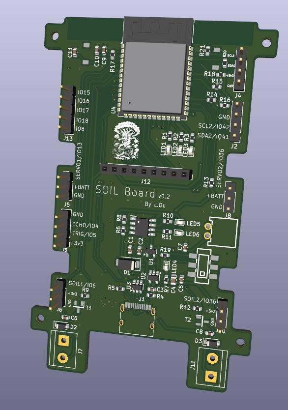

# SoilBoardEsp32

A custom PCB for the ESP32-S3-WROOM-1 designed for WiFi enabled and battery powered automated plant watering.

Could also be used to control a dual propeller drone.

Certain parts of the circuit schematic were sourced/adapted from the [LiteWing](https://github.com/Circuit-Digest/LiteWing/tree/main) open source drone project.

Setup with:
 - 2 Screw terminals for 3-4V DC water pumps
 - 2 Capacitative soil moisture sensors
 - Either a DHT-40 or AHT-40 temperature/humidity sensor
 - An optional TFT display
 - 2 optional servo headers
 - An optional ping sensor header for water level detection

## Images

